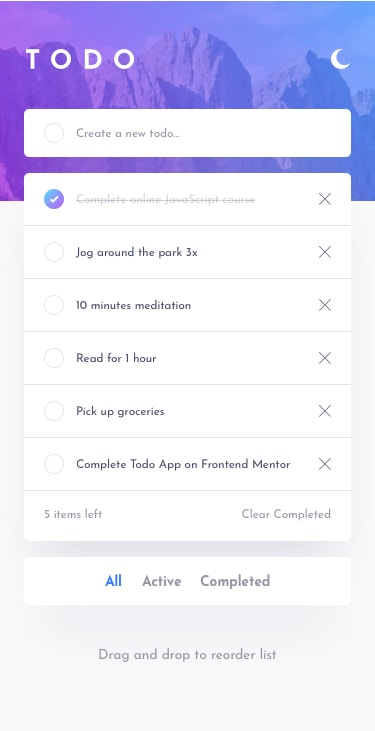
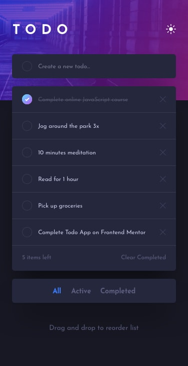
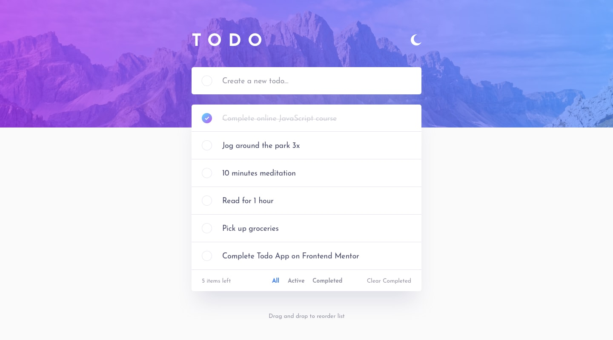
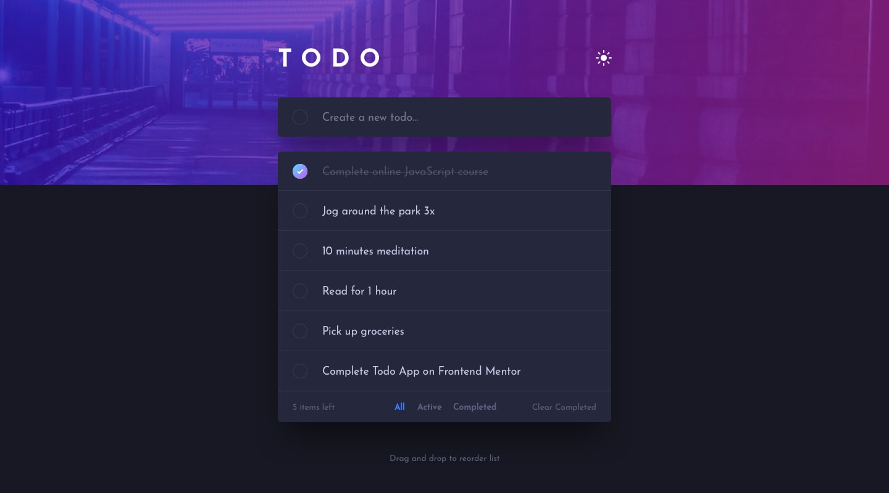
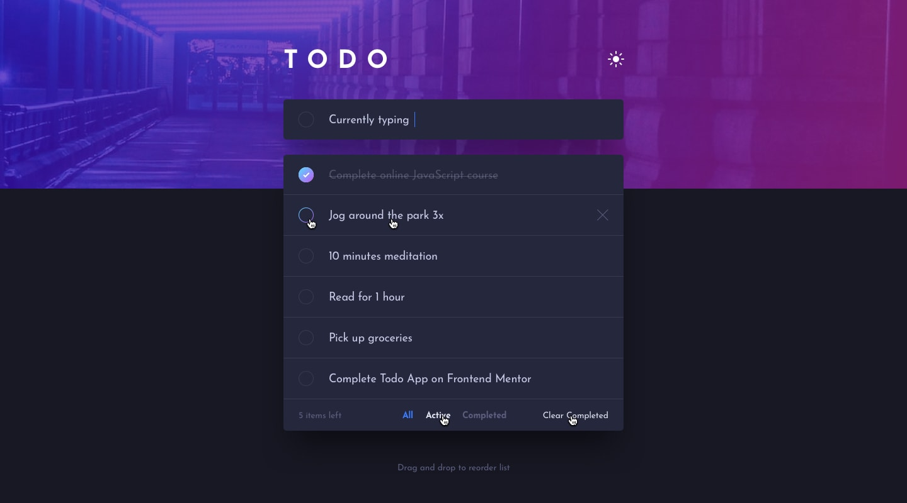

# What We Learned

## Screenshots

<table>
  <tr>
    <td>Mobile Light</td>
    <td>Mobile Dark</td>
  </tr>
  <tr valign="top">
    <td></td>
    <td></td>
  </tr>
  <tr>
    <td>Desktop Light</td>
    <td>Desktop Dark</td>
  </tr>
  <tr valign="top">
    <td></td>
    <td></td>
  </tr>
  <tr>
    <td>Active States Light</td>
    <td>Active States Dark</td>
  </tr>
  <tr valign="top">
    <td></td>
    <td></td>
  </tr>
</table>

## Vue Composition API

The project uses Vue 3 with `<script setup>`. The main benefit is that component logic stays concise while still supporting typed props, typed emits, and composables.

In this project we used:

- `ref` for mutable state like todos, filters, and theme.
- `computed` for derived values like filtered todos and active todo count.
- `watch` to persist todos and theme changes to `localStorage`.
- `onMounted` to load stored data after the browser APIs are available.
- `defineProps` and `defineEmits` for typed component contracts.

## Component Communication

Components should not directly mutate parent state. In this project:

- `TodoInput` emits `create`.
- `TodoList` emits `delete`, `toggle`, `changeFilter`, and `clearCompleted`.
- `Header` emits `toggleTheme`.
- `App.vue` connects those events to composable functions.

This keeps components reusable and easier to test.

## Composables

The app logic was extracted from `App.vue` into composables:

- `useTodos` handles todo state, filters, localStorage, create, delete, toggle, and clear completed.
- `useTheme` handles the light/dark theme, system preference, localStorage, and the `data-theme` attribute.

This makes `App.vue` a coordinator instead of a large logic container.

### `useTodos`

`useTodos` centralizes the todo behavior:

- `todos`: source state for the task list.
- `todoFilter`: current selected filter.
- `filteredTodos`: computed list rendered by `TodoList`.
- `activeTodoCount`: computed counter for active tasks.
- `createTodo`: creates a typed todo with `crypto.randomUUID()`.
- `deleteTodo`: removes one todo by id.
- `toggleTodo`: changes a todo between active and completed.
- `changeTodoFilter`: switches between all, active, and completed views.
- `clearCompletedTodos`: removes all completed tasks.
- `loadStoredTodos`: restores saved todos from `localStorage`.

### `useTheme`

`useTheme` centralizes theme behavior:

- `theme`: current light or dark theme.
- `toggleTheme`: switches between themes.
- reads the saved theme from `localStorage`.
- checks `prefers-color-scheme: dark` when there is no saved preference.
- writes the selected theme to `document.documentElement.dataset.theme`.

## Local Storage

Todos and the selected theme are saved in `localStorage`, so the app keeps the user's state after reload.

For todos, stored data is validated before being used. If invalid data is found, the app ignores it instead of crashing.

## CSS Architecture

Global styles are split into:

- `variables.css` for design tokens and theme values.
- `global.css` for resets and layout-level styles.
- component `style.css` files for component-specific styling.

The project also uses modern CSS features:

- CSS custom properties
- native CSS nesting
- logical properties like `inline-size` and `block-size`
- `clamp()` for responsive sizing
- `data-theme` selectors for theme switching

## CSS4 Features

The project uses modern CSS features that feel close to Sass while staying in native CSS:

```css
.header {
  background-image: var(--header-background);

  & .header__content {
    inline-size: min(100%, var(--content-width));
  }

  @media (width < 48rem) {
    background-image: var(--header-background-mobile);
  }
}
```

Important details:

- Native nesting uses `& .child-class`.
- Sass-style concatenation like `&__content` is not valid native CSS.
- Media queries can be nested inside the selector they affect.
- Theme-specific values are stored in CSS variables instead of duplicated styles.

## Vue Architecture

The app follows a small but scalable Vue structure:

```txt
components render UI
composables own reusable logic
types define shared contracts
assets/styles define visual tokens and layout
App.vue connects everything
```

This makes it easier to add tests later because the main behavior is no longer trapped inside the root component.

## Semantic Structure

The todo UI uses semantic HTML where it matters:

- `main` for the application shell.
- `header` for the title and theme toggle.
- `form` for creating a new todo.
- `section` for the todo list region.
- `ul` and `li` for the task list.
- `footer` for actions related to the list.
- `button` elements for interactive controls.
- `aria-label` for icon-only buttons.

## Theme Switching

The selected theme is applied using:

```html
<html data-theme="dark">
```

CSS variables change based on this attribute. This allows the layout, colors, and background images to update without changing component markup.

## PWA Support

The project uses `vite-plugin-pwa` to configure:

- web app manifest
- app icons
- service worker
- cached build assets
- installable app behavior

PWA behavior should be checked from a production build using `pnpm build` and `pnpm preview`.

## Commit Practices

Feature commits use the `add ...` pattern, for example:

```txt
add pwa support
```

Refactors use `refactor ...`, for example:

```txt
refactor todo logic
```

Fixes use `fix ...`, for example:

```txt
fix lighthouse accessibility and seo
```
